# dapp-supply-chain-coffee

DApp supply chain solution backed by the Ethereum platform.

## About

The application represents the logistic workflow of a coffee bean bag from the farmer to the final consumers and is designed to help improve the traceability of coffee beans.

The coffee needs to go through different states (harvested, processed, packed etc). The smart contracts are designed to represent these states so that it can be tracked and to manage access rights so that only the actor in charge of an action can make it.

It suits the interactions between farmers, distributors, retailers and consumers in an example of supply-chain and all the actors are represented by their ethereum addresses.

The owner of the contract is initially in charge to add the addresses to the distributor, retailer, consumer roles respectively.

- UML
  - Activity diagram

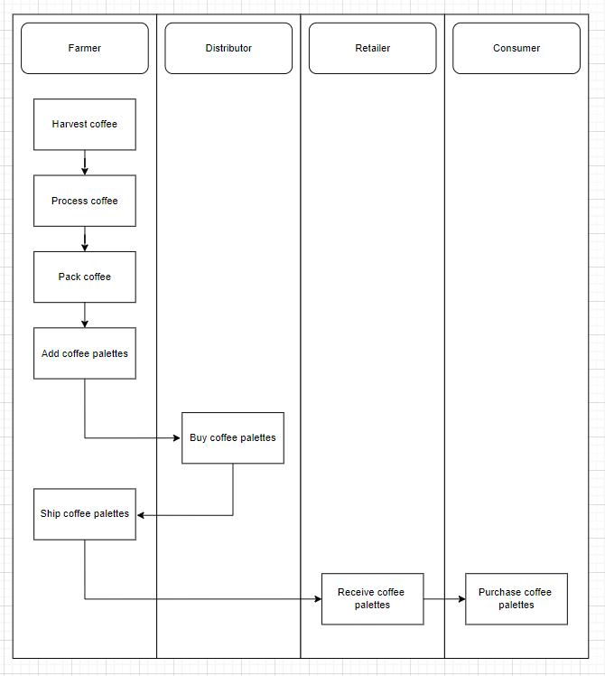

- Sequence diagram
  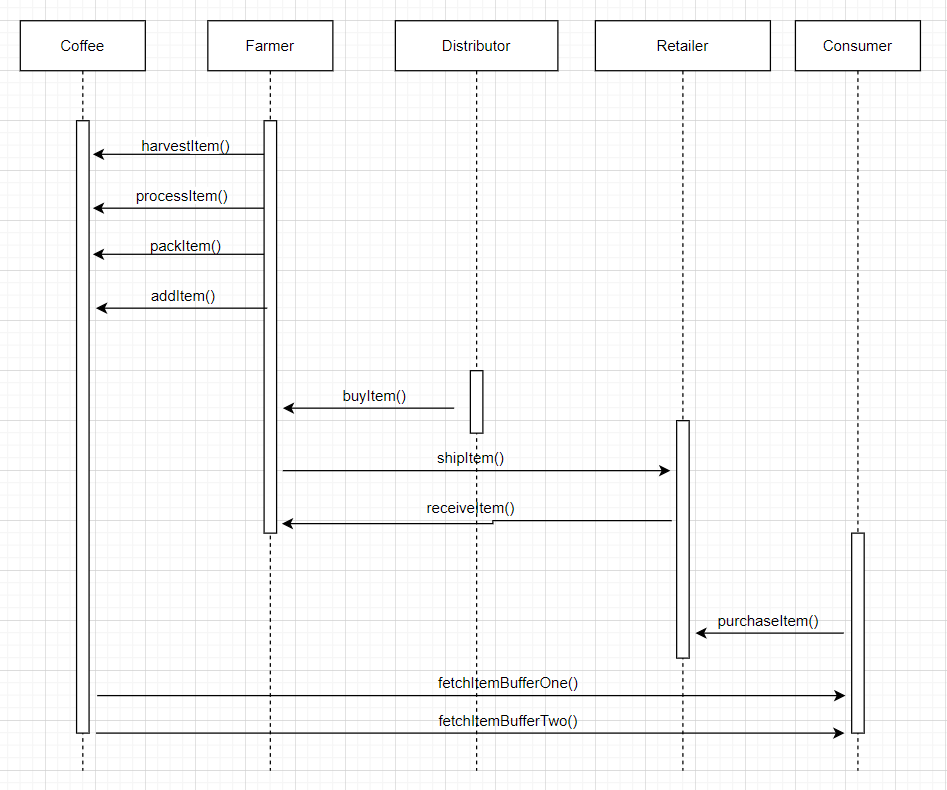

- State diagram
  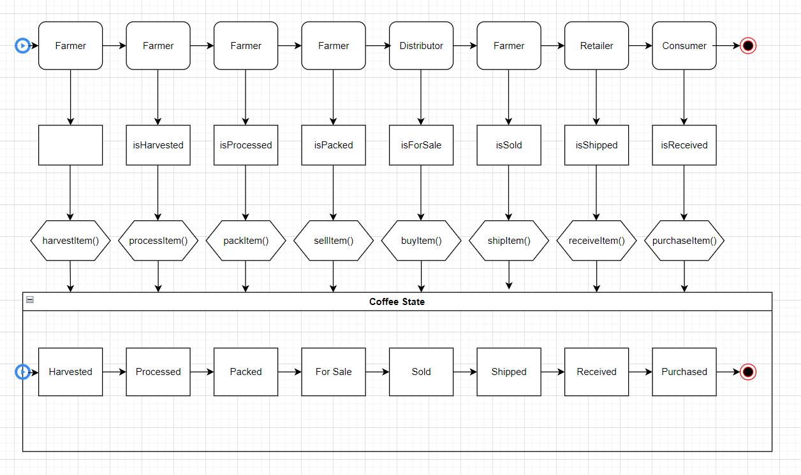

- Class diagram
  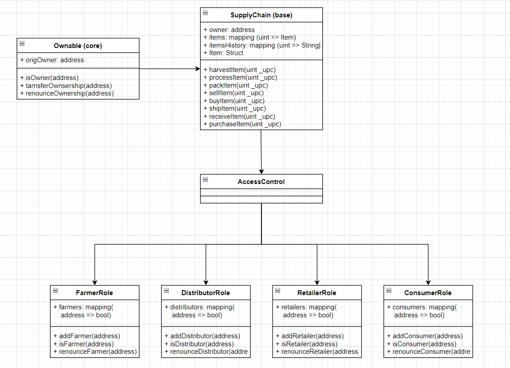

- Features

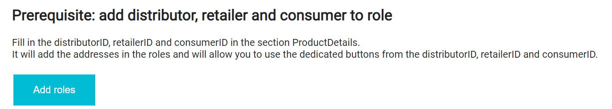

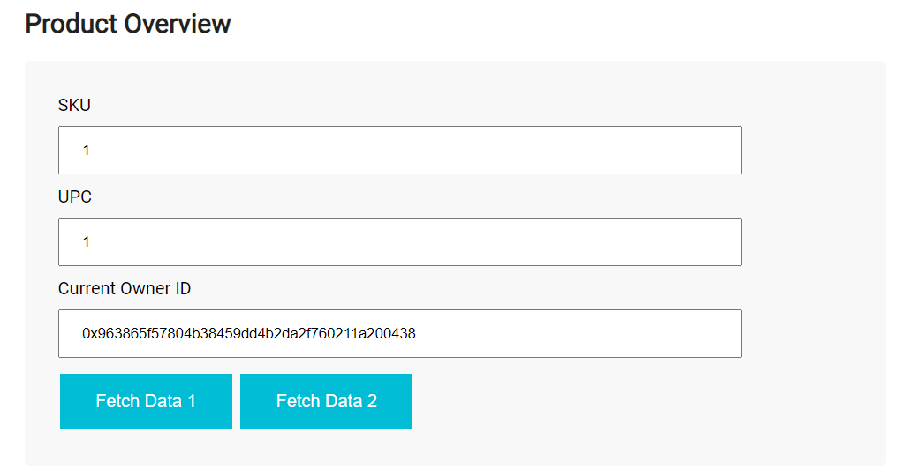
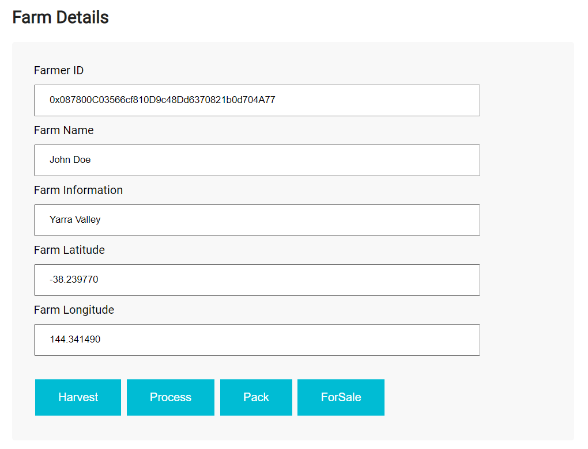
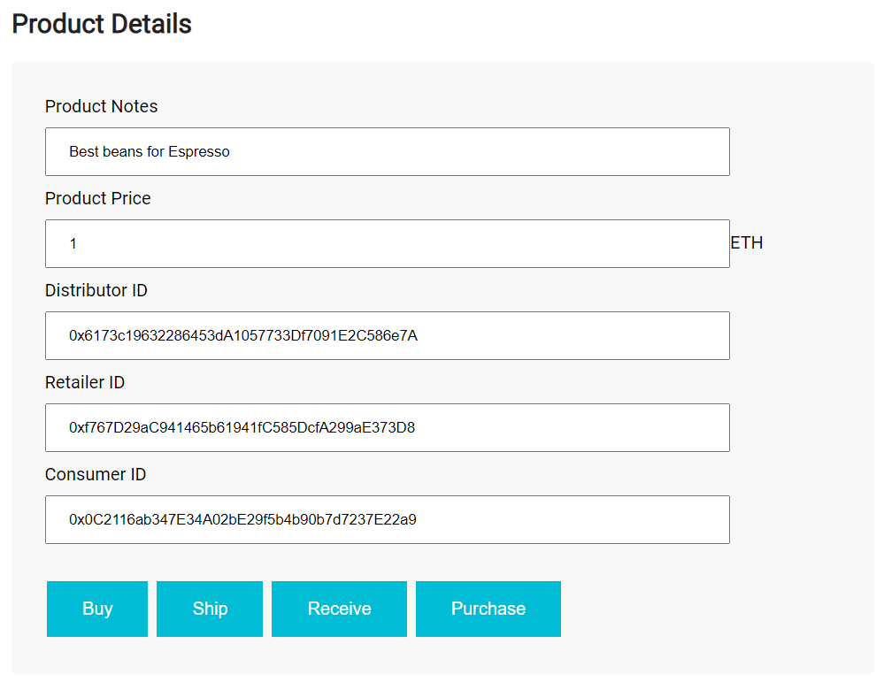

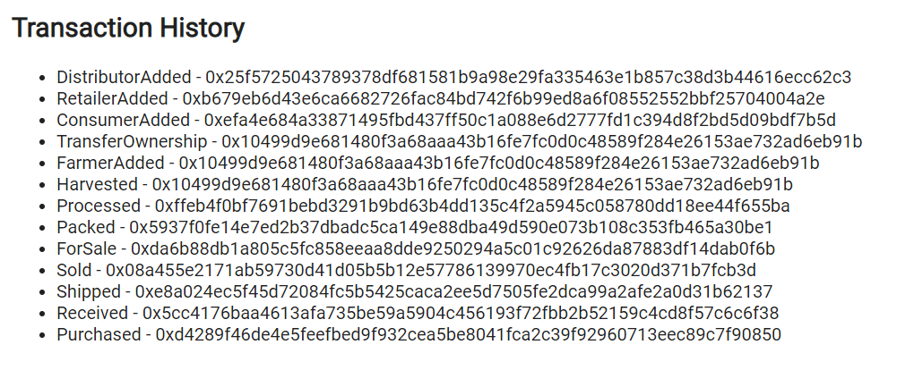

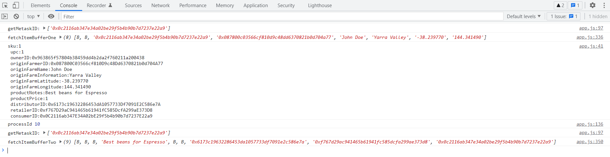

## Getting started

- Delete the build folder if any and migrate the contract to a chain (either a local ganache or ethereum based on the truffle-config.js file)

To deploy on a specific network:

```bash
truffle console --network rinkeby
compile
migrate --reset
```

To deploy on the development network (local ganache):

```bash
truffle compile
truffle test
truffle migrate --reset
```

```bash
Starting migrations...
======================
> Network name:    'development'
> Network id:      5777
> Block gas limit: 6721975 (0x6691b7)


1_initial_migration.js
======================

   Deploying 'Migrations'
   ----------------------
   ⠋ Blocks: 0            Seconds: 0   > transaction hash:    0x5ad556b9e35020405ecfc04a1c67f3d5de35eb0a9b7531cdb5c4d83e602693d8
   > Blocks: 0            Seconds: 0
   > contract address:    0x78F714842aFcB32eBD29Ee0BeA2F5271Fd7B089C
   > block number:        81
   > block timestamp:     1648642502
   > account:             0xf4806C970DaF0fC9c21e7Bd732C71031732488F4
   > balance:             109.517970979999999998
   > gas used:            273208 (0x42b38)
   > gas price:           20 gwei
   > value sent:          0 ETH
   > total cost:          0.00546416 ETH


   > Saving migration to chain.
   > Saving artifacts
   -------------------------------------
   > Total cost:          0.00546416 ETH


2_deploy_contracts.js
=====================

   Deploying 'FarmerRole'
   ----------------------
   ⠋ Blocks: 0            Seconds: 0   > transaction hash:    0xe2e48d2ee5d65dea94e7a93b48081d0e032b028893d1954f7f3d5e6db2d43a94
   > Blocks: 0            Seconds: 0
   > contract address:    0xb2EbF66aB505d4F9AA84Ed3B5c71F382d24B32bd
   > block number:        83
   > block timestamp:     1648642508
   > account:             0xf4806C970DaF0fC9c21e7Bd732C71031732488F4
   > balance:             109.510505699999999998
   > gas used:            330726 (0x50be6)
   > gas price:           20 gwei
   > value sent:          0 ETH
   > total cost:          0.00661452 ETH


   Deploying 'DistributorRole'
   ---------------------------
   ⠋ Blocks: 0            Seconds: 0   > transaction hash:    0x5f62fa76a862bc71647ba563eea5be3c689a43fd757edca5ce2ee6bcdcc5908d
   > Blocks: 0            Seconds: 0
   > contract address:    0xB367763f621093a0528a095b5fa757049AE50Fe6
   > block number:        84
   > block timestamp:     1648642512
   > account:             0xf4806C970DaF0fC9c21e7Bd732C71031732488F4
   > balance:             109.503891179999999998
   > gas used:            330726 (0x50be6)
   > gas price:           20 gwei
   > value sent:          0 ETH
   > total cost:          0.00661452 ETH


   Deploying 'RetailerRole'
   ------------------------
   ⠋ Blocks: 0            Seconds: 0   > transaction hash:    0x91acd27dcbd38e6c779986ccf87058866212a94a5f3faa7b272c1cf136fe3e9c
   > Blocks: 0            Seconds: 0
   > contract address:    0x600432Aee14ed08250B0CcFddB5923f07f79186F
   > block number:        85
   > block timestamp:     1648642516
   > account:             0xf4806C970DaF0fC9c21e7Bd732C71031732488F4
   > balance:             109.497276659999999998
   > gas used:            330726 (0x50be6)
   > gas price:           20 gwei
   > value sent:          0 ETH
   > total cost:          0.00661452 ETH


   Deploying 'ConsumerRole'
   ------------------------
   ⠋ Blocks: 0            Seconds: 0   > transaction hash:    0x89062ac43f7a6f1e3b94d78076dcdb0160fcf9781079ef84821b529c916a98a9
   > Blocks: 0            Seconds: 0
   > contract address:    0xCC4DC75940231602eA8D9b86680890D0576Ec0d2
   > block number:        86
   > block timestamp:     1648642520
   > account:             0xf4806C970DaF0fC9c21e7Bd732C71031732488F4
   > balance:             109.490662139999999998
   > gas used:            330726 (0x50be6)
   > gas price:           20 gwei
   > value sent:          0 ETH
   > total cost:          0.00661452 ETH


   Deploying 'SupplyChain'
   -----------------------
   ⠋ Blocks: 0            Seconds: 0   > transaction hash:    0x7390f085c1603830dff7b892397467d2fcfe190b8c31364968d58d34f557f153
undefined
   > Blocks: 1            Seconds: 4
   > contract address:    0xb575a1616d282fb5D9f7121D8C57900B3C58B300
   > block number:        87
   > block timestamp:     1648642527
   > account:             0xf4806C970DaF0fC9c21e7Bd732C71031732488F4
   > balance:             109.435023599999999998
   > gas used:            2781927 (0x2a72e7)
   > gas price:           20 gwei
   > value sent:          0 ETH
   > total cost:          0.05563854 ETH


   > Saving migration to chain.
   > Saving artifacts
   -------------------------------------
   > Total cost:          0.08209662 ETH

Summary
=======
> Total deployments:   6
> Final cost:          0.08756078 ETH
```

- Start the dapp:

```bash
npm run dev
```

- Deployment on the Rinkeby network:
  - Etherscan transaction: https://rinkeby.etherscan.io/tx/0x1560b45e821f469cda9ca317a0bead1f62603992f85645936ff54e0f3adb3de1
  - Contract address: 0x35C1FDdd4E1d5cc70890f150695e86dAee9dC7f5

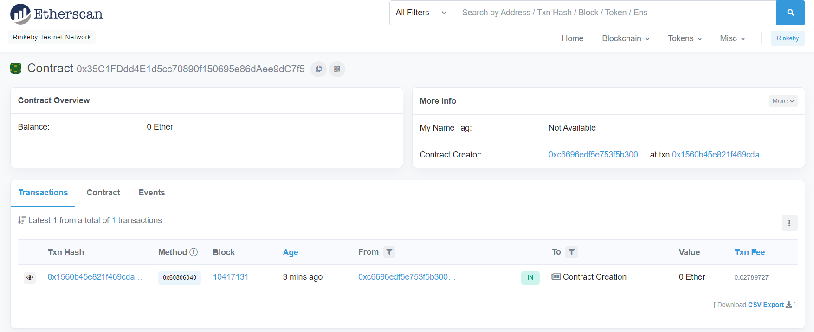

- Libraries used in the projects:
  - truffle: to help compile, test and deploy the smart-contracts
  - mocha / chai: js testing framework / assertions
  - web3: to interact with ethereum nodes

## Migration to the Polygon Mumbai test network

### Configure Metamask to connect to Polygon Mumbai test network

- Browse https://mumbai.polygonscan.com/ and click on "Add Mumbai network" at the bottom of the page

PS: Mumbai connects with Ethereum's Goërli Testnet

```bash
truffle migrate --skip-dry-run
```

```bash
Starting migrations...
======================
> Network name:    'polygon_mumbai'
> Network id:      80001
> Block gas limit: 20000000 (0x1312d00)


1_initial_migration.js
======================

   Deploying 'Migrations'
   ----------------------
   > transaction hash:    0xf4c04638a2e739338d8f837a22083f96e97d3764f33c2a5943ea5d8828c01057
undefined
undefined
undefined
   > Blocks: 1            Seconds: 13
   > contract address:    0xf768B47d3A4B803620b6FC2e5Ad9E078465afF92
   > block number:        26474947
   > block timestamp:     1653570754
   > account:             0xc6696eDf5e753f5B3009608F9e25ED2cb713C7fA
   > balance:             1.185407862452754251
   > gas used:            274508 (0x4304c)
   > gas price:           10 gwei
   > value sent:          0 ETH
   > total cost:          0.00274508 ETH

   Pausing for 2 confirmations...

   -------------------------------
   > confirmation number: 1 (block: 26474948)
   > confirmation number: 2 (block: 26474949)

   > Saving migration to chain.
   > Saving artifacts
   -------------------------------------
   > Total cost:          0.00274508 ETH


2_deploy_contracts.js
=====================

   Deploying 'FarmerRole'
   ----------------------
   > transaction hash:    0xe8c2a1445f7e02ab97abe8fef333661150e1d5469f768c7669f2b5f08a99a250
undefined
undefined
undefined
   > Blocks: 2            Seconds: 13
   > contract address:    0xEB7Cf8f70EE5c121Fd2Fb897E62c959073eD8C0e
   > block number:        26474952
   > block timestamp:     1653570804
   > account:             0xc6696eDf5e753f5B3009608F9e25ED2cb713C7fA
   > balance:             1.181635222452754251
   > gas used:            331326 (0x50e3e)
   > gas price:           10 gwei
   > value sent:          0 ETH
   > total cost:          0.00331326 ETH

   Pausing for 2 confirmations...

   -------------------------------
   > confirmation number: 1 (block: 26474953)
   > confirmation number: 2 (block: 26474954)

   Deploying 'DistributorRole'
   ---------------------------
   > transaction hash:    0x6d87ffbb3caefd62604305b4cd05f5979a4e616403b71eed195b67935f6f56ff
undefined
   > Blocks: 1            Seconds: 5
   > contract address:    0x763D6ad1DED28C1fE13254c40C6e12f49ED15fFb
   > block number:        26474955
   > block timestamp:     1653570834
   > account:             0xc6696eDf5e753f5B3009608F9e25ED2cb713C7fA
   > balance:             1.178321962452754251
   > gas used:            331326 (0x50e3e)
   > gas price:           10 gwei
   > value sent:          0 ETH
   > total cost:          0.00331326 ETH

   Pausing for 2 confirmations...

   -------------------------------
   > confirmation number: 1 (block: 26474956)
   > confirmation number: 2 (block: 26474957)

   Deploying 'RetailerRole'
   ------------------------
   > transaction hash:    0xe495a5014625bc58ac1e7dbd2151a5d57fdb21db690e59a666549d0fb56b60d9
undefined
   > Blocks: 1            Seconds: 5
   > contract address:    0x2681e5b15358Fc7414ede4543eA9C73225FedcD6
   > block number:        26474958
   > block timestamp:     1653570864
   > account:             0xc6696eDf5e753f5B3009608F9e25ED2cb713C7fA
   > balance:             1.175008702452754251
   > gas used:            331326 (0x50e3e)
   > gas price:           10 gwei
   > value sent:          0 ETH
   > total cost:          0.00331326 ETH

   Pausing for 2 confirmations...

   -------------------------------
   > confirmation number: 1 (block: 26474959)
   > confirmation number: 2 (block: 26474960)

   Deploying 'ConsumerRole'
   ------------------------
   > transaction hash:    0xb46e32fdcf30b86e3a80d8cc7ffa5aac8a1a0de71a034707ee46e1256c541758
undefined
   > Blocks: 1            Seconds: 5
   > contract address:    0xb39B4EAdB21953Ed6D463919FA2aa151Fe02D3A5
   > block number:        26474961
   > block timestamp:     1653570894
   > account:             0xc6696eDf5e753f5B3009608F9e25ED2cb713C7fA
   > balance:             1.171695442452754251
   > gas used:            331326 (0x50e3e)
   > gas price:           10 gwei
   > value sent:          0 ETH
   > total cost:          0.00331326 ETH

   Pausing for 2 confirmations...

   -------------------------------
   > confirmation number: 1 (block: 26474962)
   > confirmation number: 2 (block: 26474963)

   Deploying 'SupplyChain'
   -----------------------
   > transaction hash:    0x9b08d89a244d14048a146c4c5cac06f6c2b7ad8ab48e07bcd4a670a2ee24e739
undefined
   > Blocks: 1            Seconds: 5
   > contract address:    0xe3d67D70550084d2DFd76251c874279AcDdDC396
   > block number:        26474964
   > block timestamp:     1653570924
   > account:             0xc6696eDf5e753f5B3009608F9e25ED2cb713C7fA
   > balance:             1.143798172452754251
   > gas used:            2789727 (0x2a915f)
   > gas price:           10 gwei
   > value sent:          0 ETH
   > total cost:          0.02789727 ETH

   Pausing for 2 confirmations...

   -------------------------------
   > confirmation number: 1 (block: 26474965)
   > confirmation number: 2 (block: 26474966)

   > Saving migration to chain.
   > Saving artifacts
   -------------------------------------
   > Total cost:          0.04115031 ETH

Summary
=======
> Total deployments:   6
> Final cost:          0.04389539 ETH


- Blocks: 0            Seconds: 0
- Saving migration to chain.
- Blocks: 0            Seconds: 0
- Blocks: 0            Seconds: 0
- Blocks: 0            Seconds: 0
- Blocks: 0            Seconds: 0
- Blocks: 0            Seconds: 0
- Saving migration to chain.
```
